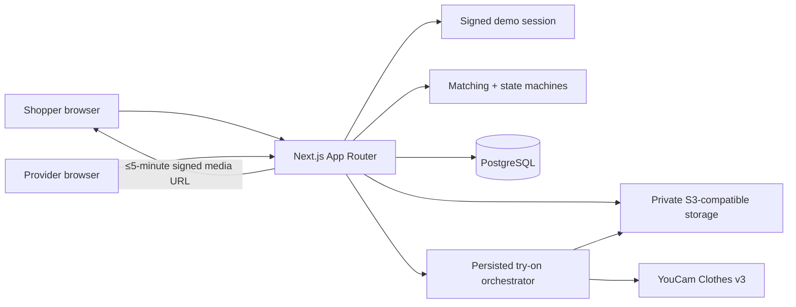

# Relay

**Relay is the reliability layer for time-sensitive fashion. Discovery apps show possibilities; Relay makes sure you have something to wear.**

Relay is a two-sided reverse marketplace for circular occasionwear. A shopper describes an event deadline, budget, style, and measurements once. Relay turns that brief into a deliberately small plan: a primary look, an independent-provider backup when supply permits, and one alternative. YouCam AI Clothes Virtual Try-On v3 renders each candidate; explainable readiness scores and provider response deadlines make the next step clear. If the primary owner declines or times out, the shopper can activate the already-rendered backup without uploading another photo. An accepted request reaches **Event ready**.

The business thesis is that virtual try-on is more valuable as a transaction trust layer for fragmented, one-of-one inventory than as another product-page effect. Relay's current business-model hypothesis is an 18% commission on completed rentals. A future version could add an event-assurance fee and route retailer returns or deadstock into local demand; neither expansion is implemented. Payments, shipping, identity checks, and damage protection are deliberately outside this prototype.

## Judge links

- Production: https://relay-youcam-marketplace.vercel.app
- Public 2:21 professional demo: https://youtu.be/K_iLJKMcykg
- Devpost project: https://devpost.com/software/relay-xr7byl
- Production evidence and submission assets: [`docs/submission/`](docs/submission/)

## What works

- Shopper brief creation with explicit photo consent and JPEG/PNG validation.
- Explicit America/Chicago event time, a 90-day horizon, and time-based urgency.
- Deterministic hard filtering and weighted, explainable top-three ranking.
- Stable primary, backup, and alternative roles, preferring a different provider for the backup.
- Component-level Event Readiness Scores for availability, measurements, proximity, style, and provider confirmation.
- A server-only YouCam Clothes v3 adapter for file registration, signed upload, task creation, polling, and private result copying.
- Independent loading, success, and failure states for each preview.
- Provider-owned listings, urgency-aware response deadlines, and private request review without exposing the shopper's source image or measurements.
- Idempotent primary requests, decline/timeout recovery, one-tap authorized backup activation, and an **Event ready** shopper timeline.
- Owner-only image deletion with immediate application-level revocation and best-effort object cleanup.
- A fully deterministic fake YouCam mode for local demos and automated tests.

Every generated preview states: “Preview shows appearance and styling, not guaranteed physical fit. Check the garment measurements before reserving.”

## Architecture



The browser never receives database credentials, object keys, signed upstream upload URLs, or the YouCam bearer token. Route handlers validate, authenticate, authorize, and idempotently apply every state change.

## Prerequisites

- Node.js 20 or newer
- npm
- Docker Desktop with Docker Compose
- Chromium installed through Playwright for E2E tests

## Local setup

From the repository root:

```bash
npm ci
cp .env.example .env
docker compose up -d --wait db minio
docker compose run --rm minio-init
npm run db:migrate
npm run db:seed
npm run dev
```

On PowerShell, replace the copy command with `Copy-Item .env.example .env`.

Open [http://localhost:3000](http://localhost:3000). Choose **Shop as a guest** for the shopper journey or **Supply your closet** for the provider journey. Local MinIO uses `http://localhost:59000`; its console is at `http://localhost:59001`.

The seed is idempotent. It creates fictional users and five listings, then uploads project-owned garment assets whose provenance is documented in [`docs/assets/attribution.md`](docs/assets/attribution.md).

Stop the local services without deleting data:

```bash
docker compose down
```

Use `docker compose down -v` only when you intentionally want to delete Relay's local database and object-store volumes.

## YouCam modes

`YOUCAM_MODE=fake` is the safe default for automated tests and a clearly labeled local demonstration. It exercises the same persisted job boundary without calling Perfect Corp.

For a consented real-API smoke test:

1. Set `YOUCAM_MODE=live` and place a valid key in `YOUCAM_API_KEY` in `.env` or the hosting provider's encrypted environment settings.
2. Keep `YOUCAM_BASE_URL=https://yce-api-01.makeupar.com`; the client rejects bearer credentials for any other origin.
3. Use a non-sensitive, consented, forward-facing full-body JPEG or PNG. Relay accepts files below 10 MB, at least 512×384, with no side above 4096 pixels.
4. Run one shopper flow and delete the brief images when validation is complete.

The live adapter uses these official Clothes v3 routes:

- `POST /s2s/v2.0/file/cloth-v3`
- Signed `PUT` to the registration response URL
- `POST /s2s/v2.0/task/cloth-v3`
- `GET /s2s/v2.0/task/cloth-v3/{task_id}`

Relay copies a successful, time-limited result into private project storage. The deletion control removes Relay's copies; Perfect Corp. may retain API files for up to 30 days under its documented upstream policy.

## Test and quality commands

```bash
npm run typecheck
npm run lint
npm run test:unit
npm run test:integration
npm run build
npm run test:e2e
npm run test:e2e:smoke
```

Integration and E2E tests expect the local PostgreSQL and MinIO services above. Install the E2E browser once with `npx playwright install chromium`. The Playwright suite runs Chromium at desktop and mobile device sizes, uses generated/project-owned imagery only, and covers the complete decline-to-backup recovery journey, the direct acceptance path, invalid-photo recovery, partial upstream failure, no-match widening, duplicate actions, unauthorized access, deletion, accessibility, reduced motion, and 320px overflow.

## Privacy and security model

- A signed, `HttpOnly`, same-site demo cookie identifies one seeded role; it is a hackathon identity simulation, not production authentication.
- Source, garment, and generated images live in a private bucket and are read through owner-authorized, short-lived Relay URLs.
- Providers receive event and garment context but never the shopper's source image or measurement profile.
- Logs omit request bodies, image bytes, measurements, API keys, object keys, and signed URLs.
- Image deletion revokes database references before storage cleanup, so a cleanup retry cannot restore browser access.
- Production secrets must remain server-only. No variable in this project requires a `NEXT_PUBLIC_` prefix.

## Production deployment

The judged deployment is [relay-youcam-marketplace.vercel.app](https://relay-youcam-marketplace.vercel.app). Deployment and live-provider checks are release operations; the local verification commands below do not mutate production.

Provision PostgreSQL and a private S3-compatible bucket before deploying. Run migrations and the seed exactly once as release steps; do not run them during `next build`.

| Variable | Production requirement |
| --- | --- |
| `DATABASE_URL` | TLS PostgreSQL URL for the production database |
| `SESSION_SECRET` | New random value of at least 32 bytes |
| `S3_ENDPOINT` | Server-reachable S3 API endpoint, not a storage console URL |
| `S3_REGION` | Bucket region |
| `S3_BUCKET` | Private bucket name |
| `S3_ACCESS_KEY_ID` | Least-privilege server credential |
| `S3_SECRET_ACCESS_KEY` | Encrypted server secret |
| `S3_FORCE_PATH_STYLE` | Usually `false`; use the provider's requirement |
| `APP_TIME_ZONE` | `America/Chicago` for the fictional launch market |
| `DEMO_MODE` | `true` for the judged role switcher |
| `YOUCAM_MODE` | `live` for the recorded success path |
| `YOUCAM_BASE_URL` | `https://yce-api-01.makeupar.com` |
| `YOUCAM_API_KEY` | Encrypted server secret; required only in live mode |

After deployment, verify that an anonymous request to a known object URL returns `403`/`AccessDenied`, complete the real-API checklist in [`docs/submission/release-checklist.md`](docs/submission/release-checklist.md), and run the non-destructive public smoke check:

```bash
PLAYWRIGHT_BASE_URL=https://your-relay-deployment.example npm run test:e2e:smoke
```

On PowerShell: `$env:PLAYWRIGHT_BASE_URL='https://your-relay-deployment.example'; npm.cmd run test:e2e:smoke`.

## Troubleshooting

- **Database connection refused:** wait for `docker compose ps` to report the database healthy and confirm ports `54329`/`59000` are unused.
- **`NoSuchBucket`:** run `docker compose run --rm minio-init`, then rerun `npm run db:seed`.
- **Photo rejected before upload:** use JPEG/PNG within the documented size and dimension limits; the rest of the brief remains filled.
- **YouCam cannot detect the person or garment:** replace only the affected image with an unobstructed, forward-facing photo. Other preview jobs continue.
- **Rate limited or temporary 5xx:** Relay stores a retryable state and applies bounded exponential backoff with jitter; do not repeatedly resubmit the brief.
- **Expired upstream result URL:** Relay asks for one refreshed status URL before recording a retryable failure.
- **No matches:** widen budget, radius, or category from the shortlist page without uploading the photo again.

## Current limitations

Relay is a judgeable marketplace prototype, not a live rental operator. Demo identities are seeded, inventory is fictional, availability is local to one launch market, and reservation/payment is simulated. The readiness score is a prioritization signal, not a guarantee or probability. Relay does not promise delivery, availability, physical fit, return reduction, or environmental impact. Production authentication, payments, payouts, logistics, damage protection, messaging, notifications, reviews, fraud controls, event-assurance fees, retailer-return routing, and multi-city liquidity are deferred.

## Submission materials

- [`docs/submission/demo-script.md`](docs/submission/demo-script.md)
- [`docs/submission/devpost-copy.md`](docs/submission/devpost-copy.md)
- [`docs/submission/release-checklist.md`](docs/submission/release-checklist.md)
- [`docs/submission/relay-rescue-shot-list.md`](docs/submission/relay-rescue-shot-list.md)
- [`devpost-submission.md`](devpost-submission.md)

## License

Relay source code and project-generated demo assets are available under the [MIT License](LICENSE). YouCam and Perfect Corp. names and APIs remain the property of their respective owners.
